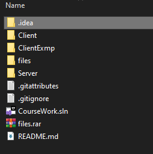

# CourseWork
## Build
Project made using .NET CORE 7
### For Visual Studio/Rider
Unzip files.rar in folder with projects like on image below:

Then open solution in your IDE. For running project you need to 
build and run Server, then ClientExmp.
### For CLI 
For this option you can unzip file.rar anywhere you want. 
Then you need to be in folder where project and run command:

`dotnet build
`

After that you need to terminal:
1st for server and 2nd for client.

For Server:

`cd Server ; dotnet run *path to "files" folder*
`

For Client

`cd ClientExmp ; dotnet run
`

### Note
Project Client is library, so it doesn't have 
function main and can't generate executable. 